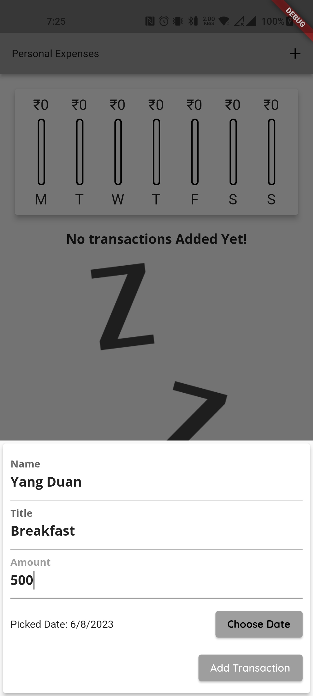

  <h1>My Transaction App</h1>

Welcome to the My Transaction App! This app allows you to manage your transactions and view them in a chart bar format. You can add new transactions, delete existing transactions, and track your expenses.

## Transaction List

The transaction list displays all your transactions in a tabular format. Each transaction includes the following information:

- Name: The name of the transaction.
- Title: The title or description of the transaction.
- Date: The date when the transaction occurred.
- Amount: The monetary amount of the transaction.

Here is an example of a transaction list:

| Name      | Title    | Date       | Amount    |
| --------- | -------- | ---------- | --------- |
| John Doe  | Purchase | 2023-06-01 | $50.00    |
| Jane Smith| Payment  | 2023-06-02 | $30.00    |
| Mark Johnson | Expense | 2023-06-03 | $20.00    |

## Weekly Transaction Chart

The weekly transaction chart provides a visual representation of your transactions over the past week. It gives you a quick overview of your spending patterns and helps you analyze your expenses. The chart bar displays the total amount spent on each day of the week.

## Adding Transactions

To add a new transaction, follow these steps:

1. Click on the "Add Transaction" button.
2. Enter the required details for the transaction, including the name, title, date, and amount.
3. Click the "Submit" button to add the transaction to the list.

## Deleting Transactions

To delete a transaction, locate the transaction in the transaction list and click on it. A confirmation prompt will appear to confirm the deletion. Click "OK" to proceed with the deletion.

Please note that deleting a transaction is irreversible, so ensure that you want to delete the transaction before confirming.

## Getting Started

To get started with the My Transaction App, follow these steps:

1. Clone the repository to your local machine.
2. Install the necessary dependencies using the package manager of your choice.
3. Run the app on a simulator or physical device.

Feel free to explore the codebase, make modifications, and customize the app to suit your needs.

## License

This project is licensed under the [MIT License](LICENSE).

  <h2>Weekly Transaction Chart</h2>
  
This chart represents the transactions in the past week:

  

    <!-- Add your chart bar component here -->
  

  
  <h2>Add Transaction</h2>
  <form>
    <label for="name">Name:</label>
    <input type="text" id="name" name="name" required>
    
    <label for="title">Title:</label>
    <input type="text" id="title" name="title" required>
    
    <label for="date">Date:</label>
    <input type="date" id="date" name="date" required>
    
    <label for="amount">Amount:</label>
    <input type="number" id="amount" name="amount" required>
    
    <button type="submit">Add Transaction</button>
  </form>
  
  <h2>Delete Transaction</h2>
  
To delete a transaction, click on the transaction and confirm the deletion.

  <ul id="transaction-list">
    <!-- Add your transaction list here -->
  </ul>
  
  <h2>Screenshots</h2>
  
  <h3>Transaction List</h3>
  
 
  <h3>Adding Parameters</h3>
  
  
  <h3>Weekly Transaction Chart</h3>
  
  
  <h3>Add Transaction</h3>
  
  
  <h3>Delete Transaction</h3>
  
  
